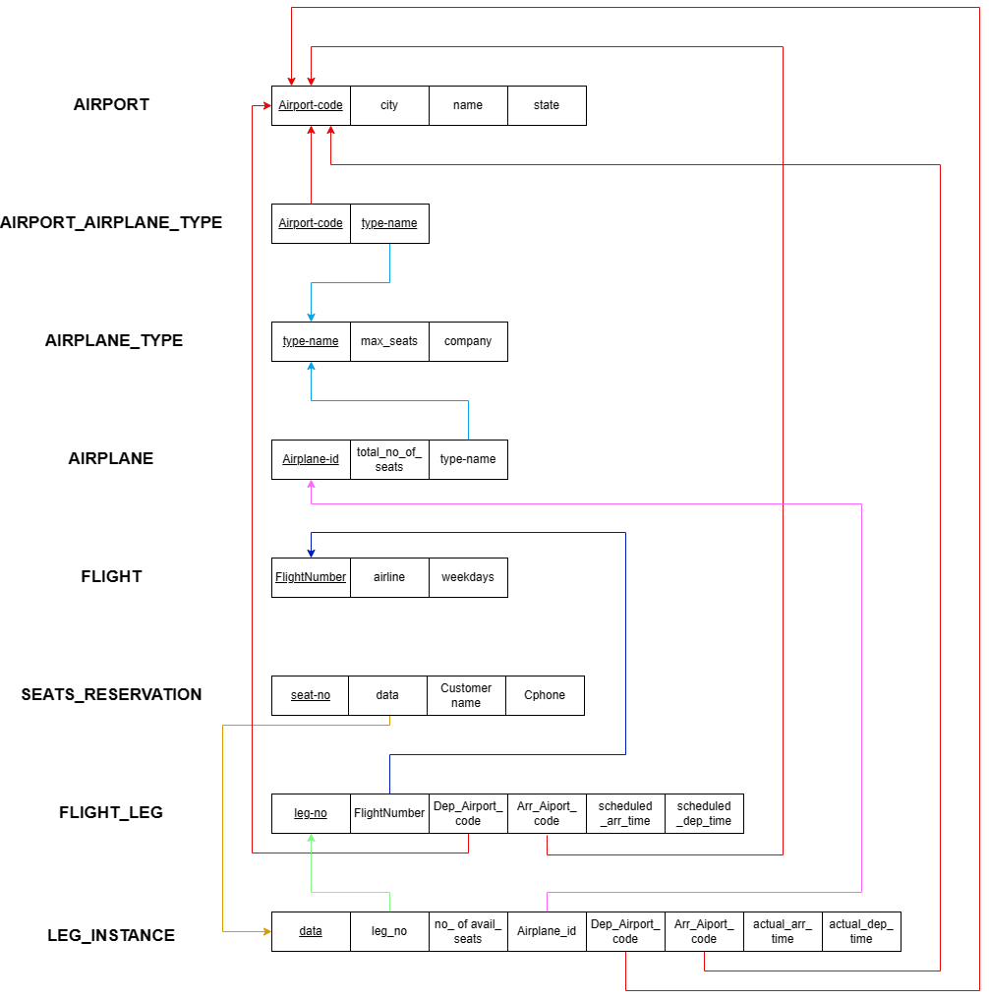
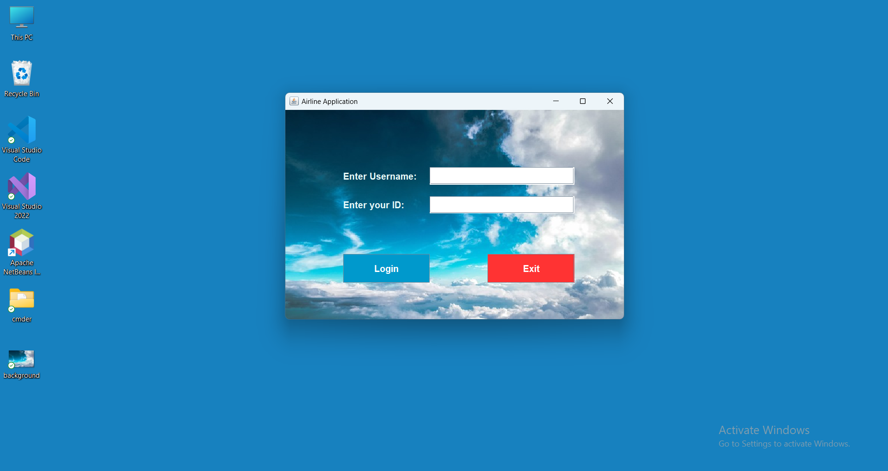
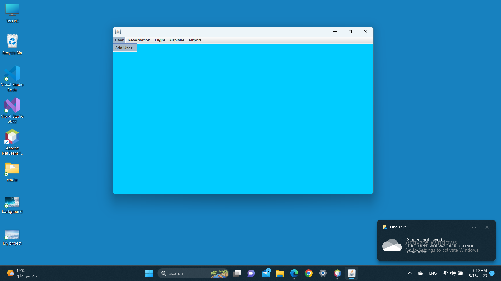

# Airline Reservation System — Java Swing + SQL Database

A first-year university project implementing an airline reservation system: a relational database design (SQL) paired with a Java Swing desktop application front-end.

## ⚠️ About this repository's contents
This project's original source was partially preserved as IDE screenshots rather than source files. Here's exactly what this repo contains and how it was recovered:

- **`database/airline_database.sql`** — the full database schema, recovered from the original text (not a screenshot) and converted to standard, runnable MySQL syntax.
- **`src/.../Frame.java`** — the login screen class, transcribed via OCR from IDE screenshots and cleaned up to compile correctly.
- **`screenshots/`** — the application's other screens (e.g., Add User) only exist as screenshots of the running app; their source code was never saved as text/screenshots, so it could not be recovered or reconstructed here.
- **`diagrams/`** — the original UML/ERD design diagrams (Class, ERD, Schema, Sequence, Activity, Communication).

## System Design

<p align="center"><b>Class Diagram</b></p>
<p align="center"></p>

<p align="center">──────────────────────</p>

<p align="center"><b>ERD Diagram</b></p>
<p align="center"></p>

<p align="center">──────────────────────</p>

<p align="center"><b>Database Schema</b></p>
<p align="center"></p>

<p align="center">──────────────────────</p>

<p align="center"><b>Sequence Diagram</b></p>
<p align="center"></p>

<p align="center">──────────────────────</p>

<p align="center"><b>Activity Diagram</b></p>
<p align="center"></p>

<p align="center">──────────────────────</p>

<p align="center"><b>Communication Diagram</b></p>
<p align="center"></p>

## Database Schema Overview
The database models a full airline booking domain: `AIRPORT`, `AIRPLANE_TYPE`, `AIRPLANE`, `FLIGHT`, `FLIGHT_LEG`, `LEG_ISTANCE`, and `SEATS_RESERVATION`, connected via foreign keys (e.g., a flight has multiple legs, each leg instance is tied to a specific airplane and has bookable seats).

## Application Screenshots

<p align="center"><b>Login Screen</b></p>
<p align="center"></p>

<p align="center">──────────────────────</p>

<p align="center"><b>Add User Screen</b></p>
<p align="center"></p>

## Tech Stack
- Java (Swing GUI)
- SQL (MySQL-compatible schema)
- NetBeans IDE

## How to Run

**Database:**
```bash
mysql -u root -p < database/airline_database.sql
```

**Application (login screen):**
1. Place a `background.jpg` image next to `Frame.java`
2. Compile and run:
```bash
javac src/com/mycompany/frame/Frame.java
java -cp src com.mycompany.frame.Frame
```
Login with username `admin` and ID `6723` (hardcoded credentials from the original coursework version — see note below).

## Note on credentials
The login check in `Frame.java` uses a hardcoded username/ID (`admin` / `6723`) rather than checking against the database. This reflects the original state of the project as recovered; a production version should validate against the `SEATS_RESERVATION`/user data in the database instead.
